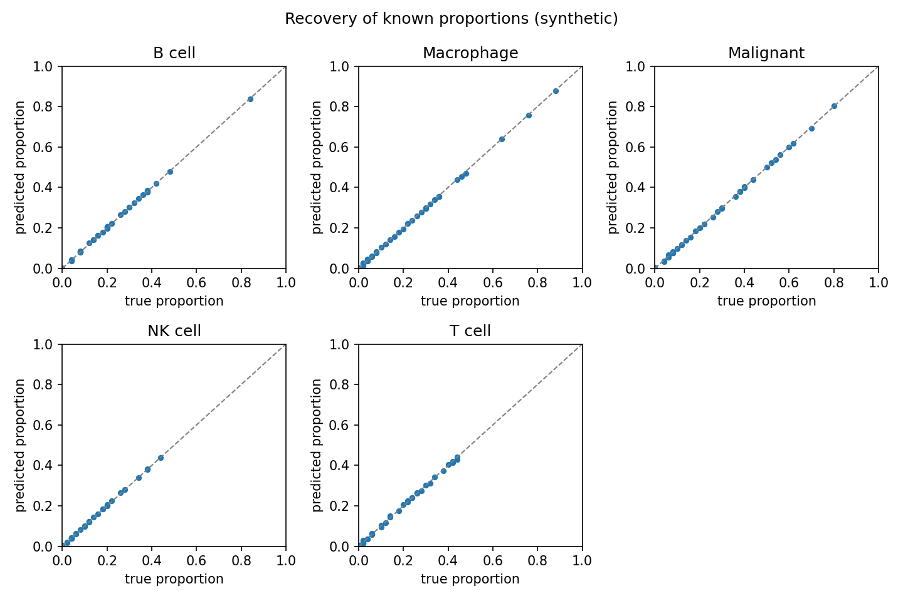
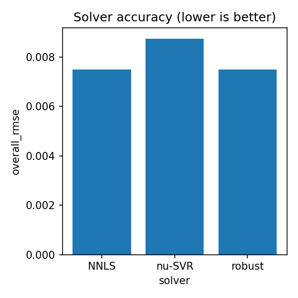

# scdecon

*Single-cell-reference deconvolution of bulk tumour transcriptomes.*

[](https://github.com/psanyalaich/scdecon/actions/workflows/ci.yml)
[](https://psanyalaich.github.io/scdecon)
[](https://www.python.org/)
[](LICENSE)

Bulk RNA-seq measures the **average** expression of a whole tissue — a tumour
biopsy is a blend of cancer cells, T cells, B cells, macrophages, fibroblasts,
and more. **scdecon** estimates *what fraction of a bulk sample comes from each
cell type*, using an annotated single-cell RNA-seq atlas as the reference.

It builds a cell-type **signature matrix** from single-cell data, then solves a
constrained regression to infer cell-type **proportions** in bulk samples —
`Bulk ≈ Signature × Proportions`, subject to non-negativity (`p ≥ 0`) and
sum-to-one (`Σ p = 1`).

## Highlights

- **Reference → signature.** QC + normalisation, marker selection, and a
  linear-scale signature matrix, all config-driven.
- **Three solvers, one interface.** NNLS, ν-SVR (CIBERSORT-style), and a robust
  regressor behind a single swappable `Solver` contract.
- **Validated against self-generated ground truth.** Simulate pseudobulk with
  known proportions, then measure recovery (RMSE / Pearson / Spearman).
- **Fair solver benchmarking** on one shared pseudobulk set.
- **Reproducible.** A typed, tested (`ruff` + `mypy --strict` + `pytest`) package,
  a Typer CLI, and a Snakemake pipeline — plus a Docker image and live docs.

## Results

On clean synthetic data the pipeline recovers known cell-type composition almost
exactly, and all three solvers are compared fairly on the same task:

| Recovery of known proportions | Solver accuracy |
|---|---|
|  |  |

*Figures are generated deterministically from synthetic data by
[`docs/generate_figures.py`](docs/generate_figures.py). Real-data results (see the
tutorial) are **relative** cross-platform estimates, not absolute fractions.*

## Installation

Requires **Python 3.11+**.

```bash
git clone https://github.com/psanyalaich/scdecon
cd scdecon
pip install -e .
```

Optional extras: `".[dev]"` (lint/type/test), `".[pipeline]"` (Snakemake),
`".[docs]"` (build the docs site). Installing the package provides the `scdecon`
command-line tool.

## Quickstart

Every command reads a single YAML **run configuration**. A minimal `run.yaml`:

```yaml
paths:
  reference: data/reference.h5ad          # your annotated single-cell .h5ad
  signature: results/signature.tsv
  bulk: results/pseudobulk.tsv
  truth: results/truth_proportions.tsv
  proportions: results/estimated_proportions.tsv
  metrics: results/benchmark_metrics.tsv
markers:
  n_markers_per_type: 25
solver:
  name: nnls
benchmark:
  solvers: [nnls, nusvr, robust]
```

Run the pipeline from the command line:

```bash
scdecon build-signature --config run.yaml   # reference -> signature matrix
scdecon simulate        --config run.yaml   # reference -> pseudobulk + truth
scdecon deconvolve      --config run.yaml   # signature + bulk -> proportions
scdecon benchmark       --config run.yaml   # compare solvers vs. truth
```

> If `scdecon` isn't on your `PATH`, use the equivalent `python -m scdecon.cli`.

### Snakemake

With the `pipeline` extra installed, the whole analysis is reproducible with one
command (the workflow shells out to the CLI):

```bash
snakemake --cores 1                                # uses config/example_run.yaml
snakemake --cores 1 --config run_config=run.yaml   # your own configuration
```

### Docker

```bash
docker build -t scdecon .
docker run --rm scdecon scdecon version
docker run --rm -v "$PWD:/data" scdecon scdecon deconvolve --config /data/run.yaml
```

## Documentation

Full docs — getting started, the CLI reference, the API reference, and a
real-data melanoma tutorial — are published at
**<https://psanyalaich.github.io/scdecon>**.

## Development

```bash
pip install -e ".[dev]"
ruff check .        # lint
ruff format --check .
mypy                # type-check (strict)
pytest              # tests
```

## Citation

If you use scdecon in your work, please cite it. Citation metadata is provided in
[`CITATION.cff`](CITATION.cff) (GitHub renders a "Cite this repository" button
from it).

## License

[MIT](LICENSE) © 2026 Prisha Sanyal-Aich
